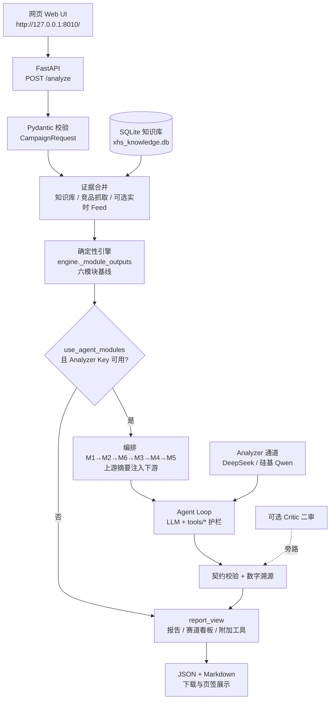

# 技术架构总览（作业交付）

> 详细说明见 [TECHNICAL_ARCHITECTURE.md](./TECHNICAL_ARCHITECTURE.md)。本文只保留评审一眼能看懂的架构图与关键清单。

## 1. 一句话原理

**大模型做策略选择，工具做算术与护栏，确定性引擎做兜底。**  
用户提交带证据的活动请求 → 合并知识库/对标抓取 → 六模块基线 →（可选）六模块 LLM Agent 调工具决策 → 报告/看板/附加工具输出。数字必须能溯源到工具或证据，否则标记人工复核。

## 2. 总体架构图

## 3. 使用的大模型

| 通道 | 环境变量 | 默认 / 推荐 | 用途 |
| --- | --- | --- | --- |
| Analyzer | `AGENT_ANALYZER_*` | DeepSeek `deepseek-v4-flash` 或硅基 `Qwen/Qwen3-8B` | 六模块 Agent 决策、可选报告润色 |
| Embedding | `AGENT_EMBEDDING_*` | 硅基 `Qwen/Qwen3-Embedding-4B` | 可选向量检索 |
| Critic | `AGENT_CRITIC_*` | 默认关闭 | 策略文本二审（不改数字） |

未配置 Key 时：**不阻断**，全案走确定性引擎，并在报告中标明未启用 LLM Agent。

## 4. 工具与护栏（节选）

| 工具域 | 代表能力 | 作用 |
| --- | --- | --- |
| `tools/budget.py` | 预算拆分、阶段节奏 | 比例求和、金额护栏 |
| `tools/competitors.py` | 竞品景观汇总 | 广告标识计数、缺口、禁止编预算 |
| `tools/content_audit.py` | 多模态内容预审 | 规则文本预审；图/视频待 OCR |
| `tools/ab_test.py` | A/B 实验矩阵 | 标题×封面×正文计划（非效果结果） |
| `tools/competitor_monitor.py` | 竞品投放监控 | 基线/增量预警 + 应对策略 |
| `tools/dashboard.py` | 数据看板投影 | KPI/导出，不伪造账户消耗 |

工具参数经 Pydantic 校验；失败作为 tool result 回传给 LLM 自我修正，而不是直接崩溃。

## 5. 数据来源

| 来源 | 内容 | 边界 |
| --- | --- | --- |
| 用户表单 / JSON | 品牌、预算、卖点、竞品链接、草稿文案 | 主输入 |
| 本地知识库 SQLite | 品类笔记、品牌 organic/paid 月度、规则 | 非全平台大盘 |
| 给定链接公开页抓取 | 赞藏评、主题、广告标识、评论画像信号 | 仅用户粘贴链接，不做全站爬取 |
| 《数据需求》导入 | 曲奇四重奏投流/内容历史基准 | 品牌自有表，非竞品后台 |
| 实时 Feed（可选） | 当前为 Mock 同构接口 | 强制 `is_mock`，不冒充真实热搜 |

## 6. 六模块业务顺序

`M1 赛道竞品 → M2 画像选题 → M6 关键词策略 → M3 达人匹配 → M4 聚光前置 → M5 预算节奏`

另有加分项：内容审核、A/B 方案、竞品监控、数据看板（网页「附加工具」页签）。

## 7. 降级与可信度

- 竞品共性由确定性证据层计算；每行显示样本覆盖、结论类型和置信度。
- 自有卖点未命中竞品主题只能标记为“样本内未覆盖候选”。
- LLM 只补充测试动作，不覆盖第03章事实表。
- 单模块 Agent 失败 → 该模块回退确定性输出，其它模块继续  
- 数字未溯源 → `llm_agent_ungrounded`，报告提示人工复核  
- Mock 补足**不会**抬高 `data_confidence`  
- 最终投放上线、放量、达人下单均由人工拍板
