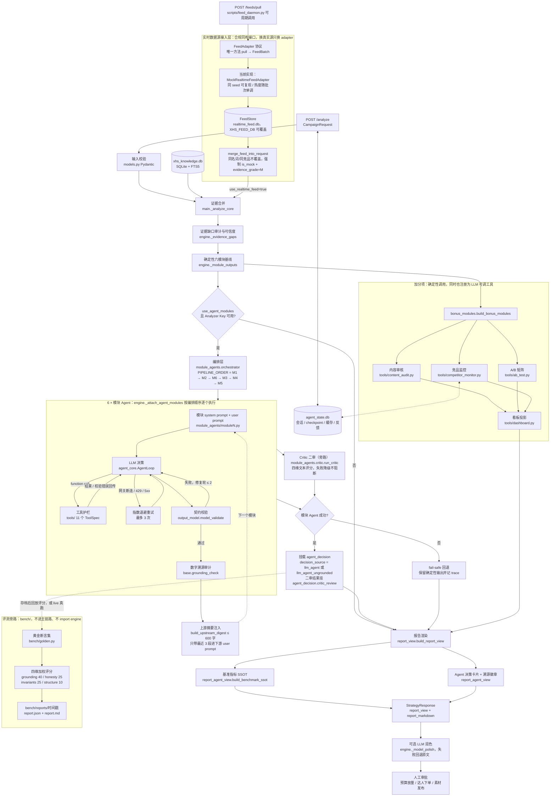
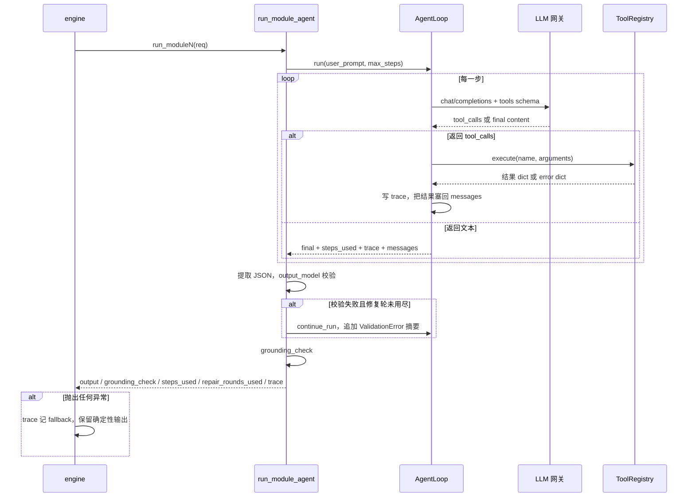
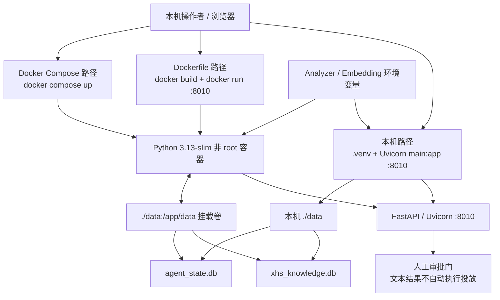

# 技术架构

> 配套文档：[测试报告](./TEST_REPORT.md)｜[使用说明书](./USER_GUIDE.md)｜[优化方向](./OPTIMIZATION_ROADMAP.md)｜[项目 README](../README.md)

## 1. 系统定位

本项目是一个本地可运行的小红书投放策略决策 Agent：FastAPI 接收带证据的活动请求，
先由确定性引擎生成六模块基线方案；在显式开启 `use_agent_modules` 且 Analyzer Key 可用时，
六个模块 Agent 按业务依赖顺序 `M1 → M2 → M6 → M3 → M4 → M5` 依次进入 Agent Loop，
由 LLM 调用工具做策略决策，上游结论压成 ≤600 字摘要注入下游 prompt，
结果以 `agent_decision` 挂载到对应模块块上。任何一个模块 Agent 失败都不阻断其它模块，
系统始终保留确定性输出作为兜底。

链路上还有两处**旁路**：显式开启后由更强模型做一次策略文本二审（Critic，
只审文本不审数字，失败降级不阻断），以及可选合并进证据区的实时数据源
（当前为模拟源，条目强制打 mock 标记）。二者都不改变主链路的降级语义。

模型不被允许「直接说数字」。所有金额、比例、出价、预估类数字必须经过工具计算，
输出必须过 Pydantic 契约，数字还要过一次溯源审计；未溯源的模块在报告里被显式降级为
`llm_agent_ungrounded`，而不是静默采纳。

### 1.1 架构演进：从规则引擎到控制权反转

| 维度 | v0.2（重构前） | 当前版本 |
| --- | --- | --- |
| 决策主体 | 确定性引擎用 if/else 算完 6 个模块 | LLM 在 Agent Loop 内调用工具做决策 |
| LLM 角色 | 仅对最终 Markdown 做润色 | 模块级决策者；润色降为可选后处理 |
| 数字来源 | 代码写死的档位与倍率 | 工具计算，LLM 只能在护栏区间内选参数 |
| 错误处理 | 参数不合法直接报错 | 校验错误作为 tool result 回传，LLM 自我修正 |
| 输出保证 | 结构由代码拼装 | Pydantic 契约强校验 + 最多 2 轮修复 |
| 可信度 | 无法区分「算出来的」与「编出来的」 | `grounding_check` 逐字段核对数字是否有工具依据 |

评审对 v0.2 的定性是「这是规则引擎，不是 Agent」。本轮重构的核心是**控制权反转**：
把「选哪档比例、用什么倍率、怎么分层、如何取舍」交还给 LLM，把「算术、边界、去重、
求和为 1、不足名额不编造」留给工具。

## 2. 总体架构图

## 3. 分层说明

### 3.1 决策层（LLM）

- `agent_core.AgentLoop`：OpenAI 兼容 function calling 循环。每步把工具 schema 一并发出，
  模型返回 `tool_calls` 就执行并把结果塞回 messages，返回纯文本即视为 final answer。
  每步写 trace（步号、工具名、参数、ok、结果），供报告与测试报告追溯。
- `module_agents/moduleN.py`：六个模块各自声明 system prompt（含「铁律」）、输出契约、
  user prompt 渲染函数与 `grounded_fields`。模块文件只依赖 `models` 与 `base`，
  **禁止 import engine**（engine 含 3.12 语法，且会造成循环依赖）。
- 决策内容举例：预算比例落哪一档、出价倍率取多少、达人如何分层、15 个选题写什么、
  关键词分到哪一级、账户按什么维度拆计划、五类风险预案怎么写。

### 3.2 工具层（确定性算术）

`tools/` 下共 **11 个已注册工具**（`tools.DEFAULT_REGISTRY`）：

| 工具名 | 文件 | 职责 |
| --- | --- | --- |
| `compute_budget_split` | `budget.py` | 自然/付费拆分 + 预热 20% / 爆发 60% / 长尾 20%，尾差归爆发期 |
| `calc_bid_range` | `bidding.py` | 阶段倍率护栏内算出价区间；缺基准 CPC 返回证据缺口 |
| `summarize_competitor_landscape` | `competitors.py` | 竞品形态聚合、内容缺口、广告标识计数、预算推断口径 |
| `plan_creator_tiers` | `creators.py` | 达人分层合作预算与聚光二次放大预算；比例必须合计为 1 |
| `match_creators` | `creator_match.py` | 粉丝分层、受众交集打分、Top 20 排序、名额缺口 |
| `estimate_paid_performance` | `forecast.py` | 测试带宽、止损线、ROI 粗算；倍率写死不可调 |
| `build_keyword_tiers` | `keywords.py` | 关键词去重、各级数量下限、预算比例、固定倍率带出价 |
| `score_content_topics` | `topics.py` | 三方向双评分 + 恰好 15 选题结构校验 + 素材阈值 |
| `audit_note_content` | `content_audit.py` | 加分项：文本合规预审 + 图片/视频 OCR 状态声明 |
| `build_ab_test_matrix` | `ab_test.py` | 加分项：标题×封面正交矩阵与判断标准 |
| `monitor_competitor_ads` | `competitor_monitor.py` | 加分项：竞品投放快照对比与预警 |

三个加分项工具是**双入口**：既在 `DEFAULT_REGISTRY` 里供 LLM function calling 调用，
也由 `bonus_modules.build_bonus_modules()` 在 `engine.run_strategy()` 中确定性执行一次，
结果落到 `modules.bonus_content_audit / bonus_ab_test / bonus_competitor_monitor`。

`tools/dashboard.py` 不是 ToolSpec，它是纯投影函数 `build_dashboard_payload()`，
由 `report_view` 调用生成 `report_view["dashboard"]`，并被 `GET /board/{report_id}` 复用。

工具层的固定常量（LLM 不可调）例如：测试带宽 `min(聚光×15%, 目标CPA×最小转化×1.5)`、
最低带宽下限 `聚光×5%`、止损 `CPC×1.5 / CPA×1.2`、ROI 区间系数 `0.7 / 1.2`、
最低样本 3000 曝光 / 100 点击、蓝海词倍率带 0.6–0.8、达人分层阈值 1 万 / 50 万粉丝。

### 3.3 护栏层

四道护栏，从内到外：

1. **参数护栏**：`ToolRegistry.execute()` 用 Pydantic `model_validate` 校验工具参数。
   失败**不抛异常**，而是返回 `{"error": "参数校验失败", "details": [...], "hint": "..."}`，
   由 LLM 读错误自我修正。工具内部异常同样被捕获成 error dict，循环不中断。
   典型护栏：`cold_start` 倍率必须落在 0.8–1.3；预算比例合计必须为 1；关键词不得重复；
   有 `baseline_cpc_cny` 就必须给来源。
2. **输出契约**：`ModuleAgentSpec.output_model` 对最终 JSON 强校验。校验失败时把
   ValidationError 摘要作为新的 user 消息追加，复用同一 messages 上下文重跑，
   **最多 2 轮修复**（`max_repair_rounds=2`），仍失败抛 `ModuleAgentError`（带 trace）。
   典型契约：模块4 的 `objective` / `placement` 是 Literal 枚举且有「全部计划必须是聚光付费计划」
   校验器；模块1 的 `targeting_hypotheses` 每条必须含「假设」；模块2 的 `tag_status`
   必须注明「标签需在聚光后台核对可用性」。
3. **数字溯源（Grounding Check）**：`module_agents/base.grounding_check()` 收集 trace 中全部**成功**
   工具结果里的数值，再按 `grounded_fields` 的点路径（支持 `*` 通配）逐个核对输出中的数字是否
   在工具数字集合中（保留 2 位小数、容差 0.01），产出 `passed` 与 `mismatches`。
   **不硬失败**，只记 `mismatches`。
4. **系统降级**：`report_agent_view.apply_agent_grounding_policy()` 把未通过溯源的模块
   `decision_source` 降为 `llm_agent_ungrounded`，报告首屏出现「⚠️ 数字未溯源模块：N」，
   摘要里累计 `agent_ungrounded_count`。

网关层还有第五道：`AgentLoop._chat()` 对 `RemoteProtocolError / ReadTimeout / ConnectTimeout /
WriteTimeout / ConnectError / PoolTimeout` 以及 HTTP `429 / 502 / 503 / 504` 做**最多 3 次指数退避重试**
（间隔 1s → 2s）；其余 4xx 直接抛 `AgentLoopError` 并带上响应体前 500 字符。

### 3.4 证据层

- `models.CampaignRequest`：品牌任务 + 多类证据（品类笔记、竞品、达人、基准指标、
  趋势词、违规台账、官方规则、自有历史），每条证据带 `source_name` / `collected_at` /
  可选 `is_mock` / `evidence_grade`。
- `knowledge_base.py`：本地 SQLite + FTS5 词法检索，按「品类 + 产品 + 卖点」召回笔记，
  按 `note_id` 去重，记录导入批次。**当前是词法检索，向量检索仍为待接入**。
- `module_agents/_evidence_aggregation.py`：模块1（自然格局）与模块4（投放时段）共用
  同一套时段桶口径（早间 06-11 / 午间 11-14 / 下午 14-18 / 晚间 18-23 / 深夜 23-06），
  避免两个模块给出两套时段定义。
- `mock_agents.py` / `mock_scenarios.py`：**数据模拟服务（显式启用）**，不是证据采集。
  仅在 `allow_mock=true` 时按种子补足缺失字段，逐字段打 `is_mock` / `evidence_grade=M` /
  警告文案；Mock 补足**不会**把 `data_confidence` 抬到 `high`。
- `realtime_feed.py`：实时数据源接入层（详见 3.8 节）。开启
  `use_realtime_feed=true` 时把已落库的批次条目合并进 `trending_keyword_evidence` /
  `competitor_evidence`，合并点在本地知识库检索**之前**；条目同样是
  `is_mock=true` / `evidence_grade=M`，同名词与同名竞品不覆盖真实证据。

### 3.5 呈现层

- `report_agent_view.py`：纯标准库、Python 3.10 兼容、**不 import engine / report_view**。
  负责三件事：Agent 决策卡片的通用递归渲染（`list[dict]` → 表格、`dict` → 键值、
  标量并入「其他」）、溯源徽章与 `decision_source` 降级、基准指标 SSOT。
- `report_view.py`：七章人可读报告 + 执行方案 + 证据附录 + 看板投影；
  网页与 Markdown 导出共用同一份 `report_view`，避免页面结论与导出结论分叉。
- `web/`：四个视图页签——分析报告 / 执行方案 / 数据看板 / 证据附录。

### 3.6 编排层（模块间依赖传递）

`module_agents/orchestrator.py` 把「谁先跑、上游结论怎么给下游」这件事收在一层，
模块文件（`module1`–`module6`）除了透传 `upstream_context` 之外零改动：

- `PIPELINE_ORDER = M1 → M2 → M6 → M3 → M4 → M5`：先赛道判读 → 人群与选题 →
  关键词词库 → 达人匹配 → 聚光决策 → 预算统筹。传子集时仍按该顺序重排；
  顺序表之外的名字记 `{"status": "skipped", "reason": "unknown_module"}`。
- `build_upstream_digest(module_name, output)`：把某模块输出压成一段
  **≤600 字**（`DIGEST_MAX_CHARS`，超长截断）的中文纯文本，只取下游用得上的结论
  （如模块1 的热门形式 / 峰时假设 / 内容空白 / 竞品定向假设 / 风险要点）。
  六个摘要函数对字段缺失全部容错，降级输出不会让编排崩掉。
- 注入口在 `module_agents/base.py`：`run_module_agent(..., upstream_context="")`，
  非空时把 `UPSTREAM_CONTEXT_HEADER` + 摘要拼到 user prompt 末尾。
  下游只注入**最近 3 段**（`run_pipeline(upstream_limit=3)`，`engine` 侧同值）。
- `build_shared_keyword_handoff(output)`：模块6 是个例外——它成功后除了 600 字摘要，
  还额外注入一段以 `SHARED_KEYWORD_HANDOFF_HEADER`（`【模块6共享词表】`）开头、
  上限 `SHARED_KEYWORD_HANDOFF_MAX_CHARS = 4000` 的**完整词表 JSON**
  （`keyword_levels` + `level_budget_split`），并明文要求模块3 直接复用、
  禁止再调 `build_keyword_tiers` 另起一套。注入窗口对这段做优先保留。
- `run_pipeline(req, module_names=None, *, runner=None, upstream_limit=3)`：
  返回 `{"modules": {...}, "pipeline_trace": [...]}`。单模块异常记
  `{"status": "failed", "reason": ..., "detail": ...}` 后**继续跑后续模块**，
  下游只是少一段上游摘要——等价于改造前的独立执行，fail-safe 语义不变。
  `runner` 可注入 `(module_name, req, upstream_context) -> result`，测试据此完全离线。

`engine._attach_agent_modules()` 复用同一套顺序与摘要函数（HTTP 链路上不走
`run_pipeline`，因为它还要往确定性模块块上挂载），trace 每条带 `upstream_digest_chars`。

### 3.7 二审层（强模型 Critic，旁路）

`module_agents/critic.py`：模块 Agent 通过契约校验并溯源之后，追加一次**只审文本、
不审数字**的二审。它是增强不是闸门——挂在主链路旁边，任何失败都不阻断模块产出。

- **四个维度**（`DimensionScores`，各 1–10 分）：`evidence_citation` 证据引用是否具体、
  `executability` 动作是否有主体/条件/阈值、`compliance_wording` 是否把假设说成事实或
  出现绝对化宣称、`consistency` 与输入目标/证据/上游结论是否自洽。
  外加 `verdict`（`pass` / `revise`）、最多 10 条 `issues`（`path` / `severity` /
  `problem` / `suggestion`）与一句 `summary`。
- **按模块定制的检查项**：`MODULE_CRITIC_CHECKLISTS` 为六个模块各列 3–5 条专项检查，
  拼进二审 prompt。它们正对着[测试报告台账](./TEST_REPORT.md)第 1–5 项的历史问题，
  例如模块4 的「campaigns 是否被误解为投放阶段」「daily_schedule 是否是投放时段
  而非值班表」「调价是否用百分比而非含糊的 0.1 倍」。
- **开关**：`AGENT_CRITIC_ENABLED`（`1`/`true`/`yes`/`on` 才开，默认关闭以控成本）、
  `AGENT_CRITIC_MODEL`（可选强模型名，缺省沿用 Analyzer 主模型）。
- **配置复用**：`load_critic_config()` 直接取 `load_analyzer_config()` 的
  api_key / base_url，**不新增第三条通道变量**，只把模型名换掉，
  并同样经过 `_normalize_chat_model()` 归一化与 `_strip_inline_comment()` 行内注释剥离。
- **降级语义**：缺 Key、网络异常、非重试 4xx、坏 JSON、契约不过、修复轮
  （`MAX_CRITIC_REPAIR_ROUNDS = 1`）用尽——一律返回
  `{"status": "degraded", "reason": ...}`，`run_critic()` 绝不抛异常；
  Critic 模块本身 import 失败时按「未开启」处理。
- **挂载位置**：`modules.<engine_key>.agent_decision.critic_review`，
  同级还有布尔 `critic_rewritten`；trace 记一条
  `{"stage": "critic_<模块名>", "status": "ok" 或 "degraded", "rewritten": bool}`；
  关闭时既不调用也不记 trace，避免噪音。
- **issues 的两条出口**（`engine._attach_agent_modules()`）：
  - 有 **high** severity 时触发**一轮定向重写**：`format_critic_rewrite_context()`
    把 high 问题渲染成一段「只修下列问题、不要改动已溯源数字、仍须满足模块契约」的
    上下文，拼在 `upstream_context` 后面重跑一次该模块；成功则用新输出替换
    `agent_decision`、重算 `decision_source`，并把剩余 medium/low 问题写进
    `human_review_items`，trace 记 `{"stage": "critic_rewrite_<模块名>", "status": "success"}`。
    重写本身失败时**回退到原输出**并把全部 issues 写进 `human_review_items`，
    trace 记 `status: "fallback"`——重写同样不是闸门。
  - 没有 high 时不重写，`merge_critic_issues_into_output()` 把 issues 以
    `[Critic/<severity>] <path>: <problem> → <suggestion>` 的格式追加进
    `human_review_items`（去重；超过 6 条时保留末尾以满足契约上限）。

### 3.8 实时数据源接入层

`realtime_feed.py` 用「接口先行」的方式接住外部数据源，**换真实源只换 adapter**：

- `FeedAdapter` 协议只有一个方法 `pull(since_ts) -> FeedBatch`；
  接真实源时新写一个实现（如 `OfficialTrendFeedAdapter`）即可，
  `FeedStore` / `merge_feed_into_request` 与 `main.py` 的接线一行都不用改。
- 当前实现 `MockRealtimeFeedAdapter`：同 seed 批次序列可复现，热度随批次
  单调升温（每批 +3，封顶 99），基准漂移限制在 ±10% 以内。
  `resume_from(store)` 让无状态调用方（HTTP 每次新建 adapter）从库里已有的
  同 seed 批次续号。
- `FeedStore`：SQLite 持久化批次与条目（默认 `data/realtime_feed.db`，
  环境变量 `XHS_FEED_DB` 可覆盖），每次操作一个短连接，FastAPI 线程池安全。
- `merge_feed_into_request()`：纯函数，dict 进 dict 出，合并进
  `trending_keyword_evidence` / `competitor_evidence`；
  **同名热搜词与同名竞品一律不覆盖**（真实证据优先），空库时是 no-op。
- **合规隔离**：所有条目强制 `is_mock=true`、`evidence_grade="M"`、
  `source_name` 带「模拟实时数据源」前缀。`M` 不在 A–E 真实等级内，
  因此永远不会抬高 `data_confidence`；`GET /feeds/status` 把这条边界
  以 `source_policy` 字段直接写进接口响应。

接线在 `main.py`：`POST /feeds/pull`（拉一批并落库）、`GET /feeds/status`、
`GET /feeds/latest`，以及 `/analyze?use_realtime_feed=true`——合并发生在**本地知识库
证据合并之前**，后续流程看到的就是合并后的请求，trace 记一条 `realtime_feed_merge`；
数据源故障时退回「不合并」并如实记 `status: failed`，不拖垮分析。
该参数已计入 `_analysis_request_hash()`，开关不同视为不同请求，幂等键不会串用。

### 3.9 评测层（bench，独立旁路）

`bench/` 三个文件各司其职，**只依赖标准库与自身，绝不 import engine / main / report_view**，
因此在只有标准库的沙盒里也能被 `unittest` 导入：

- `bench/golden.py`：六模块黄金断言集，代码即数据——诚实标记（每条给一组
  `any_of` 同义措辞，任一命中即通过）、数字不变量（可编程校验函数，阈值集中
  镜像 `tools/` 常量并在文件顶部注明来源）、关键路径存在性。
- `bench/score.py`：四维加权评分，**grounding 40 / honesty 25 / invariants 25 /
  structure 10**（`MAX_TOTAL = 100`）；grounding 是 0/40 二值，invariants 每条违规扣
  5 分扣到 0 为止，honesty 与 structure 按命中率折算。
  另有两项**不新增满分、只做减法或只记录**的附加项：
  `text`（存档里带 `critic_review` 且 `status=ok` 时，按 high×5 / medium×1.5
  从 total 扣分，上限 `WEIGHT_TEXT = 15`；无 Critic 记 `skipped`、
  degraded 记 `degraded`，两者都不扣分，所以离线回放基线仍是 100）与
  `convergence`（按修复轮记 detail，**不改 total**，避免合法满分夹具因一次修复轮掉分）。
- `bench/run_bench.py`：CLI，三选一——`--replay <存档>` 离线回放评分、
  `--live` 调 `orchestrator.run_pipeline` 真跑后评分、`--matrix` 逐案例真跑评测矩阵
  （`full_evidence` / `workbook_partial` / `minimal` 三个 example）；报告写
  `bench/reports/<UTC时间戳>/report.json` 与 `report.md`，markdown 自动带
  与上一份报告的「较上次」分差列。

## 4. 单个模块 Agent 的执行时序

各模块的溯源字段（`grounded_fields`）只覆盖**真正由工具产出的数字**，不做过度约束：

| 模块 | 溯源字段 |
| --- | --- |
| module1 | `competitor_breakdown.ad_labeled_count` |
| module2 | 三方向 `organic_score` / `paid_score`、`material_screening` 两个阈值 |
| module3 | 分层合作/放大预算、放大预算池、`match_score`、单篇放大预算 |
| module4 | 冷启动出价上下限、测试带宽、止损 CPC/CPA、ROI 点值与区间 |
| module5 | 自然/付费预算、三阶段付费预算、分层预算、冷启动/放量出价 |
| module6 | 三级预算比例 `core` / `long_tail` / `blue_ocean` |

模块1 的自然/付费格局数字多数直接来自 prompt 证据区而非工具，因此靠契约里的
`*_source` 必填字段约束，不塞进 `grounded_fields`——否则会把「正确引用证据」误判为未溯源。

## 5. 六模块依赖与当前执行顺序

```mermaid
flowchart TB
    subgraph TARGET["业务依赖顺序：orchestrator.PIPELINE_ORDER，Agent 链路已按此执行"]
        T1["M1 赛道与竞品"] --> T2["M2 用户画像与内容"]
        T2 --> T6["M6 关键词策略"]
        T6 --> T3["M3 关键词与达人匹配"]
        T3 --> T4["M4 聚光投流前置决策"]
        T4 --> T5["M5 全域预算与节奏"]
        T5 --> TH["人工审批：预算 / 达人 / 素材 / 账户"]
    end
    subgraph PASS["每步之间传什么"]
        D1["build_upstream_digest<br/>≤ 600 字中文摘要"] --> D2["拼 UPSTREAM_CONTEXT_HEADER<br/>进下游 user prompt"]
        D2 --> D3["只带最近 3 段<br/>upstream_limit = 3"]
        D3 --> D4["上游失败：只少一段摘要<br/>下游照跑，不断链"]
    end
    subgraph DETER["确定性基线：engine._module_outputs"]
        R1["M1"] --> R2["M2"] --> R3["M3"] --> R4["M4"] --> R5["M5"] --> R6["M6"]
        R6 --> RH["人工审批边界"]
    end
```

业务依赖顺序 `M1 → M2 → M6 → M3 → M4 → M5` 已由
`module_agents/orchestrator.py` 的 `PIPELINE_ORDER` 实现：
`engine._attach_agent_modules()` 与 `run_pipeline()` 都按它排序执行，
并把上游结论压成 ≤600 字摘要注入下游 prompt（详见 3.6 节）。

需要区分的是**确定性基线**：`engine._module_outputs()` 仍按数值顺序
`M1 → M2 → M3 → M4 → M5 → M6` 构建，它是纯函数式的兜底输出、模块之间本就不传结论，
不需要也没有做编排。两条链路的顺序不同是设计使然，不可混同。
另一处已共享的跨模块口径是发布时段桶（`_evidence_aggregation.py` 被模块1 与模块4 共用）。

## 6. 证据治理：等级、指标 SSOT、比例语义与 Mock 隔离

### 6.1 证据等级

`models.py`、知识库与报告链路能够保存并传播 `evidence_grade` 与 `is_mock`，
但 `engine._evidence_gaps()` 目前主要检查字段是否存在、是否全为 Mock，
**尚未程序化执行**下表 A–E 的完整冲突优先级。因此「等级允许何种结论」当前属于
文档与人工审计约束，不能描述为代码已全量强制。

| 等级 | 语义 | 允许边界 |
| --- | --- | --- |
| `A_官方或授权` | 官方规则、品牌授权账户数据或书面授权材料 | 指定对象和期间的正式事实；仍需记录来源、期间和口径。 |
| `B_公开观察` | 可复查公开页面、公开笔记或活动页 | 仅作样本内、观察时点内描述，不外推平台大盘或账户事实。 |
| `C_用户导入` | 用户提供的历史报表、达人表或业务文件 | 用户声明范围内的历史事实，需保留原文件和期间。 |
| `D_行业基准` | 有来源和适用条件的行业报告 | 测试区间或情景参考，不覆盖账户实测。 |
| `E_策略假设` | 尚未证实的策略输入 | 只形成待验证方案与补数请求。 |
| `Mock` | 明确模拟数据 | 只用于演示、培训和回归，不进入正式预算、采购、下单或账户事实。 |

### 6.2 指标单一事实源（SSOT）

目标口径覆盖 `CPC`、`CPM`、`CPA`、`CTR`、`CVR`、`ROAS`：每个候选保存值、单位、来源、
期间、公式与证据等级，再按口径可比性与证据优先级选定供下游引用的值。

代码侧当前是**部分 SSOT**：`report_agent_view.build_benchmark_ssot()` 只显式归类
CPC、CPM、CTR、CVR 与更宽泛的 conversion，尚未完整覆盖 CPA 与 ROAS；
候选选择依赖来源名中「账户 / 数据需求 / 实测」的子串与 `collected_at`，
没有执行 A–E 优先级、期间与公式可比性或完整选择契约。完整的 benchmark registry
目前由零代码治理文件与人工复核承担，不能反向宣称为代码现状。

### 6.3 两种比例的语义不可互换

- `recommended_ratio`：带 `E_策略假设` 来源、等待人工批准的**待审批正式建议**候选，
  批准后才可进入正式预算；
- `scenario_ratio`：仅用于 A/B **情景**比较，**不得进入正式预算**汇总
  （`tools/ab_test.py` 在每个矩阵单元格上都写明了这一点）。

每一对 `search + feed = 100%`。当前代码输出 `search_feed_split`，
但尚未程序化维护这两个 ratio registry 的完整审批状态。

### 6.4 Mock 隔离

`mock_agents.py` 与 `mock_scenarios.py` 是**数据模拟服务（显式启用）**，不是证据采集。
它们只在 `allow_mock=True` 时按种子补齐缺失字段或构建情景，标记 `is_mock`、`mock_seed`、
`evidence_grade=M` 与警告文案；Mock 不能提高真实证据置信度，不能写作平台、竞品或账户事实，
上线前必须由真实数据替换。

## 7. 关键设计决策及理由

### 7.1 控制权反转：LLM 决策，工具算术

**决策**：把档位选择、分层结构、文本策略交给 LLM；把加减乘除、求和为 1、去重、
排序、阈值判定交给工具。

**理由**：v0.2 的 if/else 让所有品牌拿到同一套答案，评审直接定性为规则引擎；
但把算术也交给 LLM 又会出现「预算加不起来」「比例合计 0.9」这类硬伤。
分工后既保留了策略的个性化，又保证了数字可复算——同一组工具参数任何时候重跑都得同一个数。

### 7.2 校验错误回传而非抛异常（自愈循环）

**决策**：`ToolRegistry.execute()` 任何失败都返回 error dict，附 `details` 与 `hint`。

**理由**：抛异常会打断循环，等于用一次失败换一次人工重跑。回传错误后，LLM 能读懂
「`cold_start` 阶段倍率护栏为 0.8–1.3，当前 0.5–1.5 越界；请改用 0.9–1.1」这类提示并自我修正。
实测中模块5 与模块2 都出现过「一次拒绝 → 下一步修正通过」的自愈轨迹（见
[测试报告](./TEST_REPORT.md)）。成本是多烧一步 token，收益是端到端成功率显著提高。

### 7.3 溯源审计不硬失败

**决策**：`grounding_check` 发现未溯源数字时只记 `mismatches`，不阻断输出。

**理由**：策略文本里必然存在合理的非工具数字（引用证据区的样本量、时段互动数、
人群年龄段）。硬失败会逼模型删掉这些有价值的引用，或反过来逼它把所有数字都塞进工具。
折中方案是：**输出照常给，但把未溯源的地方标出来交给人**——报告显示
`llm_agent_ungrounded` 徽章与「存在未溯源数字，需人工复核」。
`report_agent_view` 还额外规定：`grounding_check` 缺失时按未通过处理，避免静默当成成功。

### 7.4 engine 集成 fail-safe：Agent 失败回退确定性输出

**决策**：`_attach_agent_modules` 对每个模块单独 try/except，失败只写一条 fallback trace；
`use_agent_modules=true` 但 Key 缺失或为占位值时整体 skip；模型润色失败返回确定性 Markdown。

**理由**：作业演示与真实交付都不能因为一次网关 502 就交白卷。当前的降级链条是
`LLM Agent 决策 → 确定性模块输出 → 证据缺口标注`，任何一层断了下一层仍可交付；
trace 里能看到到底是哪一层降级、降级原因是什么。

### 7.5 模型可插拔（双通道配置）

**决策**：`model_config.py` 拆 Analyzer（决策/润色）与 Embedding（向量混合检索）两条通道，
各自独立的 `API_KEY / BASE_URL / MODEL`，并回退到旧的 `AGENT_OPENAI_*`；
`chat_request_extras()` 按网关拼专属字段（Qwen 关 `enable_thinking`，DeepSeek 关 `thinking`）。

**理由**：不同网关的稳定性与工具调用质量差异很大（详见[测试报告的模型对比小节](./TEST_REPORT.md)）。
把模型选择做成三个环境变量，换模型不需要改一行业务代码，也便于用同一份护栏体系
横向比较两代模型的输出质量。此外 `_normalize_chat_model()` 会把已废弃的模型别名
（如 `deepseek-chat` → `deepseek-v4-flash`）映射到当前可用模型名，避免配置文件过期直接 400。

### 7.6 Critic 只审文本、不审数字，且不阻断

**决策**：Critic 的 system prompt 里写了一条铁律——**绝对不要质疑数字大小、加总、
比例是否正确**；同时 `run_critic()` 捕获一切异常，任何失败都只返回
`{"status": "degraded", "reason": ...}`，模块产出照常挂载。

**理由**：两件事各有原因。
其一，数字已经由 `grounding_check` 做了逐字段溯源审计，让 Critic 再审一遍数字，
只会制造两套口径打架的噪音——一个能被程序判定的问题不该交给模型复议；
护栏体系的空档从来不是数字，而是「版位写成自然内容」「投放时段写成运营值班表」
这类**语义错误**（见[测试报告台账](./TEST_REPORT.md)第 1–5 项），
所以四个维度全部是文本维度。唯一的例外是数字的**文字说明**与数字本身矛盾时，
按 `consistency` 提出。
其二，二审是**旁路增强**而非闸门：如果 Critic 失败会阻断模块产出，就等于给主链路
新增了一个单点故障，用一个「可选的质量提升」换掉了「必须交付的结果」。
所以它挂在链路旁边，degraded 时报告里少一块二审信息，其余一切照旧。
这条「不阻断」原则一直贯彻到重写环节：high severity 会触发一轮定向重写，
但重写本身失败也只是回退原输出 + 把问题写进 `human_review_items`，
trace 记 `critic_rewrite_* / fallback`——**任何一步二审逻辑都不能让模块交白卷**。
定向重写的 prompt 还额外规定「不要改动已由工具溯源的数字字段」，
避免二审在修文本时把已经溯源通过的数字改坏。

### 7.7 上游摘要限 600 字，只带最近 3 段

**决策**：`build_upstream_digest()` 输出 ≤600 字纯文本（`DIGEST_MAX_CHARS = 600`），
下游只注入最近 3 段（`upstream_limit = 3`），而不是把上游完整 JSON 透传下去。

**理由**：防上下文污染。模块 Agent 的 user prompt 里本来就有大段证据区，
若再塞进上游模块的完整输出（模块2 光 15 个选题就上千字），会出现三个问题：
prompt 长度随流水线位置线性膨胀，排在最后的模块5 要读前五个模块的全文；
模型注意力被上游细节稀释，反而更容易忽略自己那份证据；
上游的措辞会被下游整段抄袭，六个模块最后长得一模一样。
限长 + 限段数把交接物压成「结论清单」而不是「全文转发」——
每个 `_digest_moduleN()` 只提取下游真正要用的字段，
比如给模块4 的是模块1 的竞品定向假设，而不是模块1 的全部风险预警。

唯一的例外是模块6 → 模块3 的词表：它必须**逐词一致**，摘要式的「前 5 个核心词」
不足以让模块3 复用同一套词库，压缩反而会制造两套词表打架。
所以这一段走独立的 `build_shared_keyword_handoff()` 通道，
放宽到 4000 字并整包传 JSON——**需要精确一致的交接走整包，只需要方向感的交接走摘要**。
代价是这两类交接物都是文本而非结构化对象，下游拿不到可校验字段（见
[优化方向第 3 项](./OPTIMIZATION_ROADMAP.md)）。

### 7.8 mock 实时数据强制 is_mock / evidence_grade=M 隔离

**决策**：`realtime_feed.py` 里所有条目的 `is_mock` 与 `evidence_grade` 不是
可选字段，而是在 `FeedTrendingItem` / `FeedCompetitorEvent` / `FeedBenchmarkDrift`
三个契约上写死默认 `True` / `"M"`，转换成证据时（`_trending_to_evidence()` /
`_competitor_event_to_evidence()`）再硬编码覆盖一次；`source_name` 统一带
「模拟实时数据源」前缀。

**理由**：模拟数据最危险的地方不是「假」，而是**接口和真实源长得一模一样**——
`FeedAdapter` 协议本身就是为了让两者可互换而设计的，这份同构性在演示时是优点，
在证据链里是风险：一旦某批 mock 数据混进 A/B 等级，报告会把「模拟热搜」
渲染成可采信的趋势结论。所以隔离必须做在**数据结构层**而不是调用约定层：
调用方无论怎么写，都拿不到一条没有 mock 标记的 feed 条目。
`M` 不属于 A–E 任何一级，因此天然不参与真实证据等级判定，也不会抬高
`data_confidence`；`merge_feed_into_request()` 还规定同名热搜词与同名竞品
一律不覆盖已有条目，保证真实证据永远优先。
换真实源时，前缀判断与硬编码标记自然失效——这正是期望行为。

## 8. Analyzer / Embedding 双通道与部署

### 8.1 双通道

`model_config.py` 维护两条独立、可由 Docker 环境变量配置的模型通道：

- **Analyzer**：模块 Agent 决策与可选报告润色都走 `load_analyzer_config()`。
  未配置 Analyzer Key 时，模块 Agent 跳过、润色跳过或回退，不影响确定性策略。
  API Key、base URL 与 model 依次可回退到 `AGENT_OPENAI_API_KEY`、
  `AGENT_OPENAI_BASE_URL`、`AGENT_OPENAI_MODEL`。
- **Embedding**：`load_embedding_config()` + `embedding_client.py` 已接入
  `knowledge_base.hybrid_search`（关键字分词/FTS + 向量 RAG + RRF 融合）。
  有有效 `AGENT_EMBEDDING_API_KEY` 时调用远程 `/embeddings`；否则使用本地 hash
  向量兜底，保证混合检索链路可离线运行。API Key 可回退到 `AGENT_OPENAI_API_KEY`，
  base URL 与 model 使用 `AGENT_EMBEDDING_*` 或 Embedding 默认值。

### 8.2 部署路径

本机路径由课程仓 `.venv` 直接运行 Uvicorn；Dockerfile 路径可单独 `docker build` /
`docker run`；`docker-compose.yml` 构建同一个 Dockerfile、映射 `8010:8010`、
挂载 `./data:/app/data` 以持久化双 SQLite，并传入 Analyzer、Embedding 与旧变量兼容配置。
容器 healthcheck 访问 `http://127.0.0.1:8010/health`。三种路径都只产出待人工审批的报告，
不自动执行投放。向量检索容器、外部向量数据库与模型代理均为**计划中**部署项，
不是当前 Compose 文件的服务。

## 9. 技术栈清单

| 层 | 选型 | 版本/说明 |
| --- | --- | --- |
| 运行时 | Python | Docker 镜像 `python:3.13-slim`；`report_view.py` 使用 3.12+ f-string 语法 |
| Web 框架 | FastAPI + Uvicorn | `fastapi==0.136.1`、`uvicorn[standard]==0.46.0` |
| 数据契约 | Pydantic v2 | `pydantic==2.11.4`；请求模型、工具参数、模块输出契约共用 |
| HTTP 客户端 | httpx | `httpx==0.28.1`；`MockTransport` 用于测试注入，无需真实网关 |
| 表单上传 | python-multipart | `0.0.20`；达人 CSV 上传 |
| 持久化 | SQLite（标准库 `sqlite3`） | `data/xhs_knowledge.db` 证据库（含 FTS5）、`data/agent_state.db` 状态库、`data/realtime_feed.db` 实时数据源批次库（`XHS_FEED_DB` 可覆盖） |
| 模型接入 | OpenAI 兼容 Chat Completions + function calling | 硅基流动（默认 `Qwen/Qwen3-8B`）/ DeepSeek，可换；Critic 复用 Analyzer 通道，仅换模型名 |
| 前端 | 原生 HTML + JS + SVG | 无框架、无图表库依赖 |
| 测试 | `unittest` | 29 个测试文件、332 个测试方法 |
| 评测 | `bench/`（纯标准库） | 六模块黄金断言集 + 四维加权评分，回放存档基线 `overall = 100` |
| 部署 | Dockerfile + docker-compose | 非 root 用户运行，`./data:/app/data` 卷持久化，healthcheck 打 `/health` |

## 10. 当前边界（不夸大）

- **向量检索未接入**：`load_embedding_config()` 配置就绪，但 `knowledge_base.py` 仍是
  SQLite FTS 词法检索，向量召回与重排属计划项。
- **模块交接是文本而非结构化契约**：编排已按 `M1 → M2 → M6 → M3 → M4 → M5`
  执行并注入上游摘要（模块6 → 模块3 走 4000 字整包词表），但交接物始终是文本，
  没有独立的 Pydantic 交接模型，下游拿不到可校验字段；
  「模块3 必须复用模块6 词表、不得再调 `build_keyword_tiers`」是 prompt 级约束，
  没有程序化硬校验（见[优化方向](./OPTIMIZATION_ROADMAP.md)第 3 项）。
- **实时数据源当前只有 mock 实现**：`FeedAdapter` 协议与接线已就绪，
  挂的是 `MockRealtimeFeedAdapter`，条目一律 `is_mock=true` / `evidence_grade=M`，
  **不可当作真实趋势或竞品事实**；没有真实合规趋势源时，模块6 的
  `trending_monitor.data_source_status` 仍应标注「待接入数据源」。
  竞品监控的定时器与预警订阅出口未做，快照仍只在用户发起 `/analyze` 时更新。
- **Critic 的成本不可忽略**：二审默认关闭
  （`AGENT_CRITIC_ENABLED` 未开启时既不调用也不记 trace）；
  开启后一次分析要多跑六次二审，high severity 还会再多跑一轮模块重写，
  **成本与耗时都会显著上升**。
- **评测的离线基线只有满证据一份存档**：`bench/fixtures/regression_outputs.json`
  是「合法满分」参照，`--matrix` 的另外两个案例需要真跑模型才有结果，
  尚未沉淀成可离线回放的 fixture。文本分依赖存档里带 `critic_review`，
  离线基线不带，因此该维度在日常回归里恒为 `skipped`（不扣分）。
- **SSOT 覆盖有限**：`build_benchmark_ssot()` 只显式归类 CPC / CPM / CTR / CVR 与宽泛
  conversion，选用规则是「来源名含账户 / 数据需求 / 实测者优先，同优先级取 `collected_at` 最新」，
  尚未覆盖 CPA / ROAS 与口径可比性判断。
- **部分契约靠 prompt 约束而非硬校验**：例如模块4 的「调价必须用百分比」「daily_schedule
  不得写成运营值班表」是 system prompt 铁律 + 字段 description 约束，没有正则硬校验；
  而 `objective` / `placement` 枚举、`budget_share` 合计为 1 是硬校验器。
- **多模态审核是文本规则预审**：图片/视频只返回 `pending_ocr` / `pending_frame_scan`，
  不伪造视觉识别结果。
- **合规红线**：不绕过登录、验证码、robots 或平台条款采集数据；无来源的竞品预算、
  达人报价、实时热搜一律只能作为待验证假设；最终投放上线、预算放量、达人下单
  均由人工拍板。
