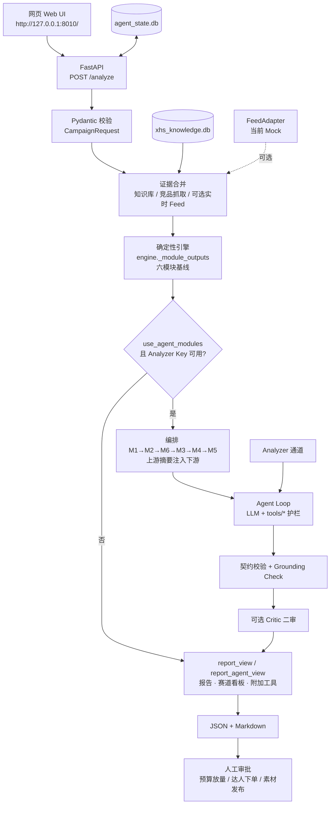
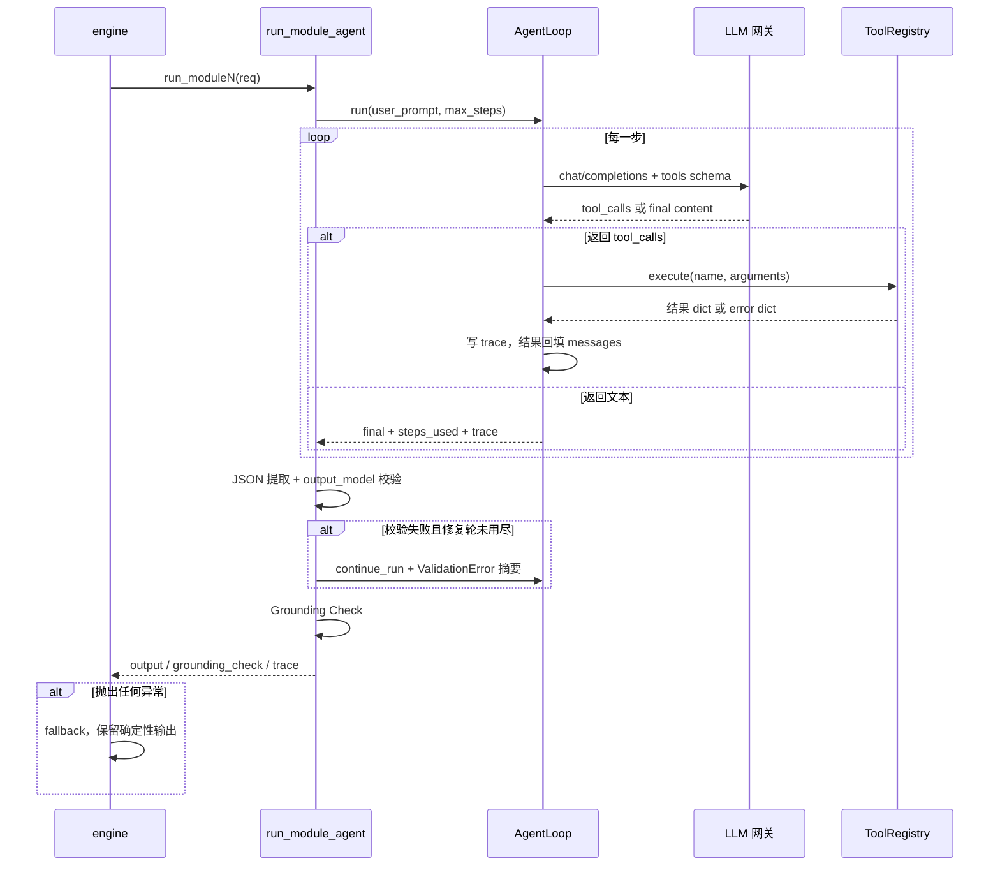
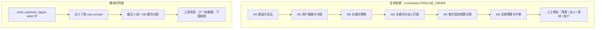

# 技术架构

> **作业交付文档之四**（实现原理 · 大模型与工具 · 数据来源）。  
> 同套交付：[使用说明书](./USER_GUIDE.md)｜[测试报告](./TEST_REPORT.md)｜[后续优化方向](./OPTIMIZATION_ROADMAP.md)｜可运行原型见 [README](../README.md)

---

## 0. 一句话原理

**大模型做策略选择，工具做算术与护栏，确定性引擎做兜底。**

用户提交带证据的活动请求 → 合并知识库 / 对标抓取 / 可选实时 Feed → 六模块确定性基线 →（可选）六模块 LLM Agent 按业务顺序调工具决策 → 契约校验 + Grounding Check → 报告 / 赛道看板 / 附加工具。数字必须能溯源到工具或证据，否则标记人工复核；未配置模型 Key 时全案仍可离线交付。

---

## 1. 系统定位与控制权反转

本仓库是本地可运行的小红书投放策略决策 Agent：FastAPI 接收 `CampaignRequest`，先由 `engine` 生成六模块基线；在 `use_agent_modules=true` 且 Analyzer Key 可用时，六个模块 Agent 按 `M1 → M2 → M6 → M3 → M4 → M5` 进入 Agent Loop，由 LLM 调用 `tools/` 决策，上游结论压成 ≤600 字摘要注入下游。任一模块失败只回退该模块确定性输出。

| 维度 | 规则引擎时代 | 当前 Agent |
| --- | --- | --- |
| 决策主体 | if/else 算完六模块 | LLM 在 Agent Loop 内调工具 |
| LLM 角色 | 仅润色 Markdown | 模块级决策者；润色可选 |
| 数字来源 | 代码写死档位 | 工具计算，LLM 只在护栏内选参 |
| 错误处理 | 非法参数直接报错 | 校验错误回传，LLM 自愈 |
| 可信度 | 难区分算/编 | `Grounding Check` 逐字段溯源 |

旁路：可选 Critic 文本二审（不审数字、失败不阻断）；可选实时 Feed（当前 Mock，强制 `is_mock`）。

---

## 2. 总体架构图

---

## 3. 使用的大模型

配置入口：`model_config.py`（双通道，可插拔）。

| 通道 | 环境变量 | 默认 / 推荐 | 用途 |
| --- | --- | --- | --- |
| **Analyzer** | `AGENT_ANALYZER_API_KEY` / `BASE_URL` / `MODEL`（可回退 `AGENT_OPENAI_*`） | DeepSeek `deepseek-v4-flash` 或硅基 `Qwen/Qwen3-8B` | 六模块 Agent 决策、可选报告润色 |
| **Embedding** | `AGENT_EMBEDDING_*` | 硅基 `Qwen/Qwen3-Embedding-4B` | `knowledge_base.hybrid_search`（关键字/FTS + **向量 RAG** + RRF）；无 Key 时本地 hash 向量兜底 |
| **Critic** | `AGENT_CRITIC_ENABLED` / `AGENT_CRITIC_MODEL` | 默认关闭 | 策略文本二审；复用 Analyzer 的 Key/URL，仅换模型名 |

未配置 Analyzer Key：**不阻断**，跳过模块 Agent 与润色，确定性引擎完整可用。

网关：OpenAI 兼容 Chat Completions + function calling；对超时/429/5xx 最多 3 次指数退避。

---

## 4. 工具与护栏

### 4.1 已注册工具（`tools/` · `DEFAULT_REGISTRY`）

| 工具名 | 文件 | 职责 |
| --- | --- | --- |
| `compute_budget_split` | `budget.py` | 自然/付费拆分 + 预热/爆发/长尾节奏 |
| `calc_bid_range` | `bidding.py` | 阶段倍率护栏内出价区间 |
| `summarize_competitor_landscape` | `competitors.py` | 竞品形态聚合、样本内未覆盖候选、广告标识计数 |
| `plan_creator_tiers` | `creators.py` | 达人分层合作与放大预算 |
| `match_creators` | `creator_match.py` | 受众打分、Top 排序、名额缺口 |
| `estimate_paid_performance` | `forecast.py` | 测试带宽、止损、ROI 粗算 |
| `build_keyword_tiers` | `keywords.py` | 关键词去重、各级下限、预算比例 |
| `score_content_topics` | `topics.py` | 三方向评分 + 15 选题结构 |
| `audit_note_content` | `content_audit.py` | 文本合规预审；图/视频 `pending_ocr` |
| `build_ab_test_matrix` | `ab_test.py` | 标题×封面矩阵；单元格含 `scenario_ratio`（仅情景，**不得进入正式预算**） |
| `monitor_competitor_ads` | `competitor_monitor.py` | 竞品投放快照对比与预警 |

加分项工具为双入口：LLM 可调 + `bonus_modules` 确定性执行。`tools/dashboard.py` 是投影函数，非 ToolSpec。

模块1 竞品事实表另由确定性模块 `competitor_insight_analysis.py` 产出（覆盖率 / 结论分级 / 置信度）；Agent 只写行动建议，不得覆盖事实层。

### 4.2 四道护栏

1. **参数护栏**：工具参数 Pydantic 校验失败 → error dict 回传，不抛崩循环。  
2. **输出契约**：模块 `output_model` 强校验，修复轮 ≤2。  
3. **Grounding Check**：按 `grounded_fields` 核对输出数字是否出现在成功工具结果中；不硬失败，记 `mismatches`。  
4. **系统降级**：未溯源 → `llm_agent_ungrounded`；单模块 Agent 失败 → 保留确定性输出。

预算侧另有语义：`recommended_ratio` 为带 `E_策略假设`、待审批的**正式预算**候选；`scenario_ratio` 仅用于 A/B **情景**比较，**不得进入正式预算**。

---

## 5. 数据来源

| 来源 | 内容 | 边界 |
| --- | --- | --- |
| 用户表单 / JSON | 品牌、预算、卖点、竞品链接、草稿 | 主输入 |
| `xhs_knowledge.db` | 品类笔记、品牌 organic/paid 月度、规则；`hybrid_search` | 非全平台大盘；加权 CTR 等来自品牌 `paid_metrics` |
| 给定链接公开页抓取 | 赞藏评、主题、广告标识、评论画像信号 | **仅用户粘贴链接**，不做全站爬取 |
| 《数据需求》/ 投流表导入 | 曲奇四重奏等品牌自有基准 | 非竞品后台 |
| `scripts/fetch_keyword_heat.py` | 5118 搜索指数或无 Key 下拉代理 | SEO 热度 ≠ 小红书热搜 |
| 实时 Feed（可选） | `FeedAdapter` → `realtime_feed.db` | 当前 Mock，强制 `is_mock` / `evidence_grade=M` |
| `agent_state.db` | 会话、checkpoint、竞品监控快照、反馈、alerts | 状态与订阅，非平台实时 API |
| **数据模拟服务** | `mock_agents.py` / `mock_scenarios.py` | 仅 `allow_mock=true`；不抬高 `data_confidence` |

### 5.1 证据等级（文档 + 字段传播；完整 A–E 冲突优先级未全量程序化）

| 等级 | 语义 |
| --- | --- |
| `A_官方或授权` | 官方规则、品牌授权账户数据 |
| `B_公开观察` | 可复查公开页/笔记 |
| `C_用户导入` | 用户报表、达人表 |
| `D_行业基准` | 有来源的行业报告 |
| `E_策略假设` | 待验证策略输入 |
| `Mock` | 演示/回归专用 |

### 5.2 指标 SSOT（目标口径）

目标覆盖 `CPC`、`CPM`、`CPA`、`CTR`、`CVR`、`ROAS`。代码侧由 `report_agent_view.build_benchmark_ssot()` 做**部分**归类（CPC/CPM/CTR/CVR 等）；CPA/ROAS 与完整 A–E 优先级仍依赖人工复核与 `evidence_policy.py`。

---

## 6. 分层说明（实现要点）

### 6.1 决策层

- `agent_core.AgentLoop`：function calling 循环，逐步写 trace。  
- `module_agents/moduleN.py`：system prompt 铁律、输出契约、`grounded_fields`；**禁止 import engine**。  

### 6.2 证据与编排

- `competitor_insight_analysis.py`：竞品笔记 → 维度行（事实/推断/假设/证据不足）+ 空白候选分级。  
- `module_agents/orchestrator.py`：`PIPELINE_ORDER`、上游摘要、M6→M3 共享词表 handoff。  
- `module_agents/_evidence_aggregation.py`：M1/M4 共用发布时段桶。  

### 6.3 呈现层

- `report_view.py`：七章报告 + 赛道看板 + 附加工具投影。  
- `report_agent_view.py`：决策卡片、溯源徽章、基准 SSOT（纯标准库，不 import engine）。  
- `web/`：对标拆解 / 聚光前置 / 附加工具 / 证据附录。  

### 6.4 Critic 与 Feed（旁路）

- Critic：四维文本分；high → 一轮定向重写；失败 degraded，不交白卷。  
- Feed：换真实源只换 `FeedAdapter` 实现；合并在知识库检索之前。  

### 6.5 评测旁路

`bench/`（不 import engine）：黄金断言 + 四维评分（grounding 40 / honesty 25 / invariants 25 / structure 10）。

---

## 7. 单个模块 Agent 执行时序

| 模块 | 主要溯源字段（工具数字） |
| --- | --- |
| M1 | `competitor_breakdown.ad_labeled_count` |
| M2 | 方向分、素材筛选阈值 |
| M3 | 分层/放大预算、`match_score` |
| M4 | 出价上下限、测试带宽、止损、ROI |
| M5 | 自然/付费与阶段预算、出价 |
| M6 | 三级预算比例 |

---

## 8. 六模块依赖顺序

确定性基线 `engine._module_outputs()` 仍按 M1…M6 数值顺序构建（模块间不传结论），与 Agent 编排顺序不同是设计使然。

加分项：内容审核、A/B、竞品监控、数据看板（网页「附加工具」）。

---

## 9. 部署路径

推荐：在仓库根目录 `docker compose up -d`（项目名 `xiaohongshu-agent`，端口 8010）。三种路径都只产出待人工审批的报告，不自动投放。

---

## 10. 技术栈

| 层 | 选型 |
| --- | --- |
| 运行时 | Python 3.13（Docker）；部分报告代码需 3.12+ |
| Web | FastAPI + Uvicorn |
| 契约 | Pydantic v2 |
| HTTP | httpx（测试可用 `MockTransport`） |
| 持久化 | SQLite：`xhs_knowledge.db` / `agent_state.db` / `realtime_feed.db` |
| 模型 | OpenAI 兼容 Chat + function calling；Embedding 可选 |
| 前端 | 原生 HTML/JS/SVG |
| 测试 / 评测 | `unittest` + `bench/` |
| 部署 | Dockerfile + Docker Compose |

---

## 11. 当前边界（不夸大）

- 竞品洞察已证据化，但**语义分类器（Embedding 分桶）**仍是后续方向；当前为确定性信号提取。  
- 模块交接以文本摘要为主，尚无独立 Pydantic `Handoff*` 硬校验。  
- 实时 Feed 正式 5118 Adapter 未进主链路；无真实源时模块6 应标「待接入数据源」。  
- Critic 默认关闭；开启后成本显著上升。  
- SSOT 未完整覆盖 CPA/ROAS 与 A–E 全优先级。  
- 多模态审核：图/视频仅为 `pending_ocr` / `pending_frame_scan`。  
- **合规红线**：不绕过登录/验证码/robots；无来源预算与热搜只能作假设；最终投放由**人工审批**。
